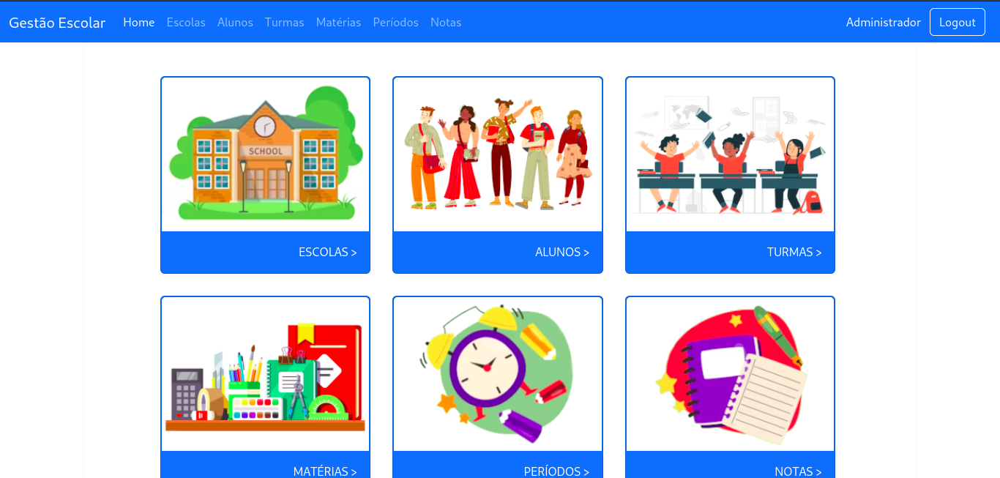
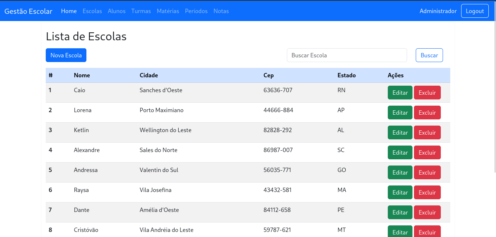
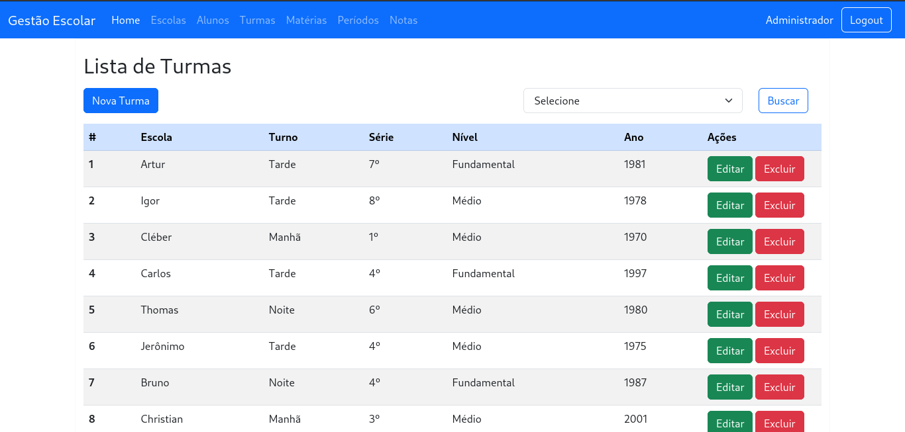

# Gestão Escolar

Sistema de Gestão Escolar desenvolvido em PHP com Laravel e API REST.

## Módulos:

- Login
- Escolas
- Alunos
- Turmas
- Matérias
- Períodos
- Notas

## Requisitos:

- PHP >= 7.4.33
- MySql >= 5
- Composer

## Tecnologias:

- PHP
- JS
- Jquery
- Json
- CSS and SCSS
- Bootstrap
- Composer
- Artisan
- Laravel
- Swagger

## Instalação:

## Banco MySql

Criar o banco de dados MySql.

## Criar e configurar arquivo .env

```bash
  cp .env.example .env
```

Variáveis de ambiente do .env

-   DB_CONNECTION=mysql
-   DB_HOST=127.0.0.1
-   DB_PORT=3306
-   DB_DATABASE=db_name
-   DB_USERNAME=root
-   DB_PASSWORD=

## Gerar a key do projeto

```bash
  php artisan key:generate
```

## Instalar as dependências do projeto

```bash
  composer install
```

## Criar as tabelas

```bash
  php artisan migrate
```

## Popular as tabelas

Será populado 15 registros por execução

```bash
  php artisan db:seed
```

## Iniciar o Servidor do Laravel

```bash
  php artisan serve
```

## Acesso ao Sistema

Para acessar o sistema utilize o seguinte endereço:<br>
http://localhost:8000/

Usuário: admin<br>
Senha: admin

## Acesso ao Swagger

Para acessar o Swagger utilize o seguinte endereço:<br>

http://localhost:8000/swagger-ui

## Licença

Projeto licenciado sob <a href="LICENSE">The MIT License (MIT)</a>.<br><br>

## Screenshots

 <br><br>
 <br><br>
 <br><br>
 <br><br>
 <br><br>
 <br><br>
 <br><br>
 <br><br>
 <br><br>
 <br><br>
 <br><br>


Desenvolvido por<br>
Danilo Meneghel<br>
danilo.meneghel@gmail.com<br>
http://danilomeneghel.github.io/<br>
